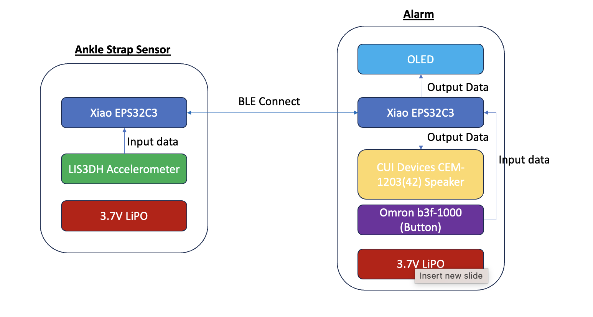
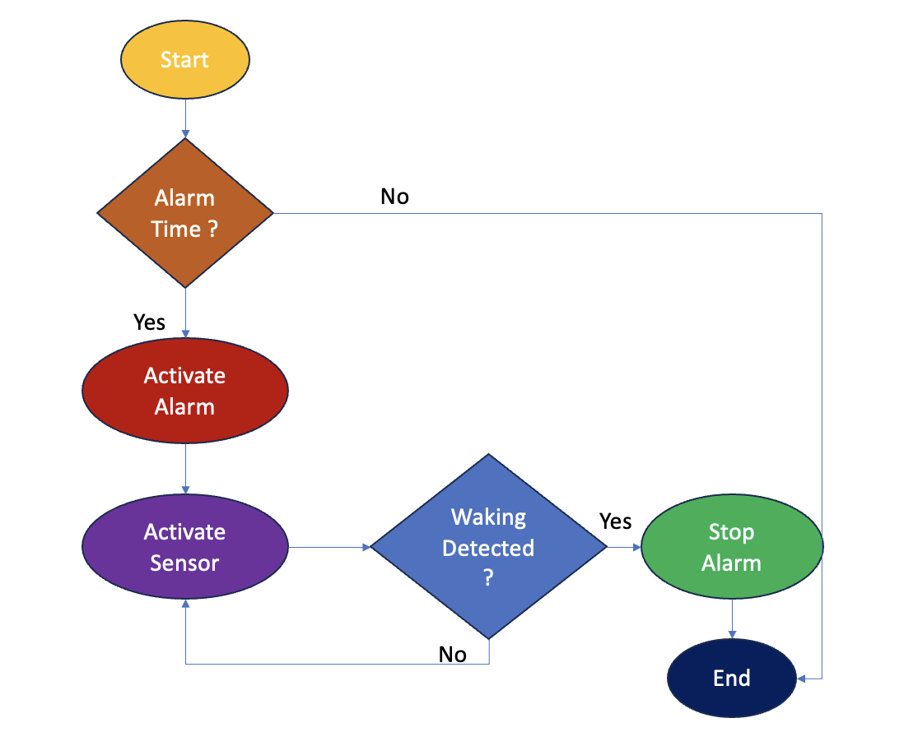

# TECHIN514_W26_Final-Project
## Project Title: Motion-Activated Wake-Up Alarm System

#### Description: An alarm clock system with an ankle-worn strap that uses an accelerometer to detect walking movement. The alarm continues ringing until the user gets out of bed and walks for three consecutive minutes, ensuring they are fully awake before the alarm stops.

---------

## 1.Sensor Device: Ankle Strap Motion Sensor

The ankle strap is a wearable sensor device built on a custom-designed PCB. It is designed to be lightweight and compact while reliably detecting walking motion and communicating wirelessly with the bedside alarm unit.

### Hardware Components

Microcontroller: Seeed Studio XIAO ESP32-C3 (Bluetooth Low Energy)

Accelerometer: LIS3DH 3-axis accelerometer

Battery: 3.7V 100mAh LiPo battery (with protection circuit)

Charging IC: MCP73831

Voltage Regulation: 3.3V low-dropout regulator (LDO)

Connector: JST-PH 2-pin battery connector

Additional components: power switch, decoupling capacitors

### How It Works

The LIS3DH accelerometer measures 3-axis motion data to detect walking activity. The ESP32-C3 processes this data and determines whether continuous walking is occurring. When walking is detected, the device tracks elapsed walking time and transmits status updates to the display unit using Bluetooth Low Energy (BLE). Power consumption is minimized through motion-based interrupts and deep sleep modes.

### Power Design
The custom PCB integrates a 3.7V 100mAh LiPo battery with onboard charging and regulation. This battery capacity provides sufficient peak current for BLE transmission while keeping the device small and wearable. Proper decoupling capacitors are used to ensure stable operation during wireless communication.

------

## 2.Display Device: Bedside Alarm Unit

The display device is a bedside alarm unit responsible for alerting the user and confirming when the walking requirement has been completed. It receives walking status data from the ankle strap sensor and controls the alarm behavior.

### Hardware Components

Microcontroller: Seeed Studio XIAO ESP32-C3

Alarm output: Piezo buzzer

Visual indicator: LED indicator

User input: Tactile push button

Power source: USB power or external power supply

### How It Works

At the scheduled alarm time, the display device activates the buzzer and visual indicator. It receives walking status and elapsed walking time from the ankle strap via Bluetooth Low Energy (BLE). While the user is walking, the display provides visual feedback to indicate progress. Once three continuous minutes of walking are confirmed, the display device automatically stops the alarm.

### User Interaction

A single push button is used for basic interaction, such as acknowledging the alarm or resetting the system. The alarm cannot be permanently dismissed until the walking condition is satisfied.

----
## Diagram

## Workflow

